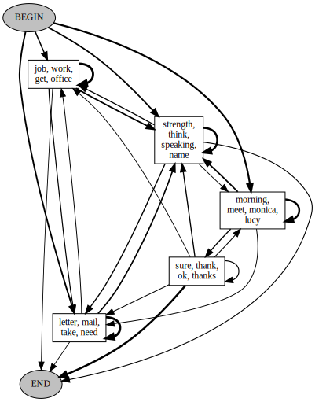
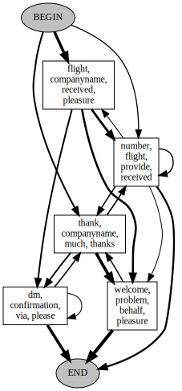

# Обобщенный граф диалога

- *Финальную версию работы* можно найти [тут](./ShtykovPD_dialog_graph.pdf)

- *Ноутбук с экспериментами* можно найти [тут](./src/base_notebook.ipynb)

- *Статьи по теме* можно найти [тут](./articles.md)

- *Дневник исследований* можно найти [тут](./diary.md)

## Аннотация

Обработка естественного языка (NLP ) является ключевой задачей в машинном обучении,
а обработка диалогов является важной ее частью. Одной из слабо изученных областей
в обработке диалогов является проблема построения и представления общей структуры
диалога.

Естественно предположить, что у диалогов из одной области может быть некоторая общая
структура. Так же естественно представлять эту структуру в виде графа. Такой граф
позволяет представить информацию о корпусе однородных диалогов в сжатой форме,
подходящей как для визуализации, так и для встраивания в более сложные диалоговые
системы. В данной работе предложена формализация понятия обобщенного графа диалога
и базовые способы его построения и визуализации.

## Примеры получившихся графов диалога

*Граф диалога с 5-ю вершинами для датасета DailyDialog (тема: работа):* 

*Граф диалога с 5-ю вершинами для датасета Twitter Customer Support (тема: авиакомпании США):*

